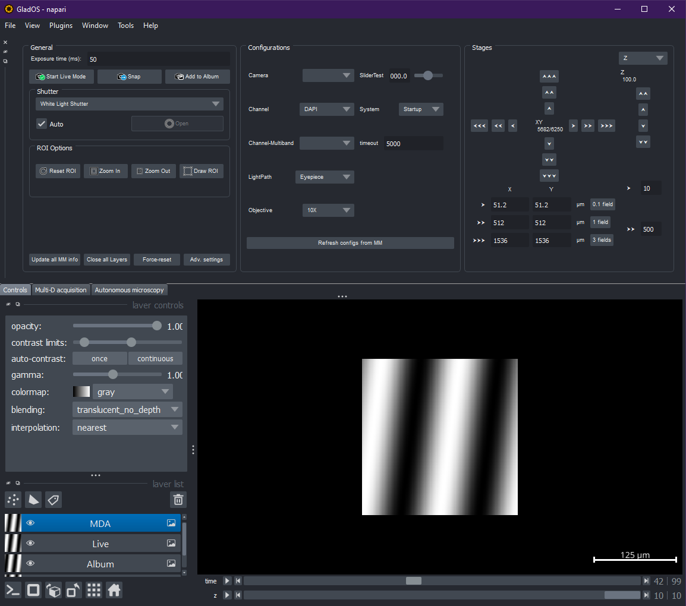
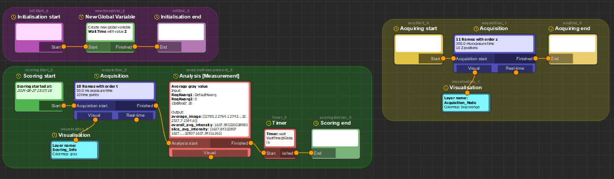

# Glados-pycromanager

Glados-pycromanager is an attempt to (1) create a usable, user-friendly user-interface for Pycromanager (i.e. python-Micromanager) with Napari, and (2) to create easy, user-friendly autonomous microscopy via Pycromanager.  

Created by:  
Dr. Koen J.A. Martens, koenjamartens{at}gmail.com, 2023-2024  
CC BY-NC-SA 4.0 licence

Please contact me if you want to use/extend/etc.

## Installation instructions, user manual

Find the user manual with installation instructions [here](glados-pycromanager/glados_pycromanager/Documentation/UserManual.md)

## Detailed developer instructions

The Glados-pycromanager codebase is explained [in this document](glados-pycromanager/glados_pycromanager/Documentation/index.html)

### Glados-pycromanager is a work-in-progress!
