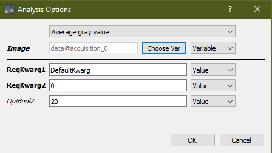
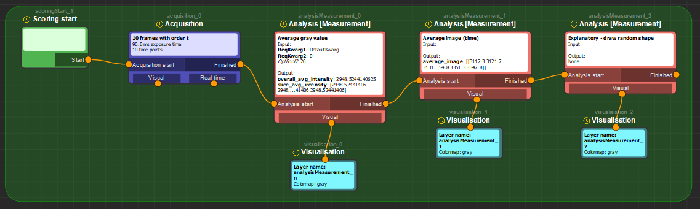
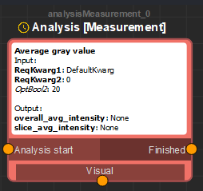
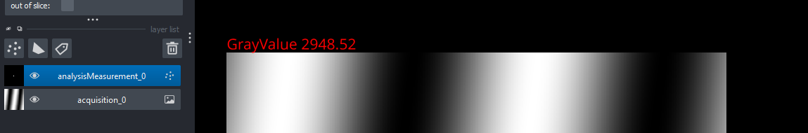
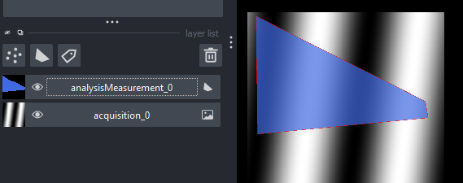
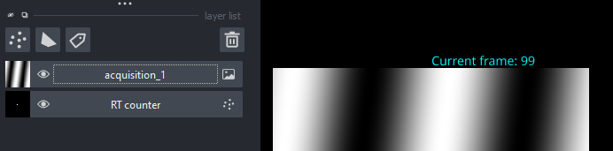

# Glados-pycromanager Developer manual

Author: Koen J.A. Martens  
koenjamartens@gmail.com  
Created 2023-2024

<!-- TOC -->
- [General overview](#general-overview)
- [Installation instructions](#installation-instructions)
- [Running instructions](#running-instructions)
- [First use instructions](#first-use-instructions)
    - [Controls](#controls)
    - [Multi-D acquisition](#multi-d-acquisition)
- [Autonomous microscopy - Overview and Example 1: Simple autonomous microscopy](#autonomous-microscopy---overview-and-example-1-simple-autonomous-microscopy)
    - [Glados-pycromanager high level concept](#glados-pycromanager-high-level-concept)
    - [Glados-pycromanager recipes](#glados-pycromanager-recipes)
    - [Glados-pycromanager decision and scanning widgets](#glados-pycromanager-decision-and-scanning-widgets)
    - [Glados-pycromanager variables](#glados-pycromanager-variables)
    - [Testing and running Glados-pycromanager autonomous microscopy](#testing-and-running-glados-pycromanager-autonomous-microscopy)
- [Autonomous microscopy - Example 2: Advanced autonomous microscopy](#autonomous-microscopy---example-2-advanced-autonomous-microscopy)

<!-- /TOC -->

## General overview

Glados-pycromanager is an attempt to (1) create a usable, user-friendly user-interface for Pycromanager (i.e. python-Micromanager) with Napari, and (2) to create easy, user-friendly autonomous microscopy via Pycromanager.

This manual contains information about how to extend the autonomous microscopy of Glados-pycromanager.

## Debug notes

It is by far easiest to run Glados-pycromanager in debug mode, via a github clone, running `GUI_napari.py`. This allows you to add breakpoints to developed code and scripts.

## Types of extensions

Generally, in the Glados-pycromanager autonomous microscopy, there are 3 (plus one semi) methods to implement extensions:

1. **Custom Functions** are functions which do not expect any input or output, but are simply called by glados-pycromanager. Examples for this are iterative auto-focus finding, setting advanced stroboscopic laser modes, or controlling external devices (i.e. python-connected, but not micromanager-connected).  
    - The semi-custom method is related to this: **Run advanced script**. This is simply a location for users to put a JAVA, Micro-Manager script (i.e. micro-manager's tools-script panel). It's not advised to use this and transfer this logic to CustomFunctions.
2. **Analysis methods** are methods that are designed to perform some kind of 'off-line' analysis, i.e. after the acquisition is completed. General examples are to perform segmentation, calculate an average image, or counting the number of fiducial markers.
3. **Real-Time analysis methods** are similar to analysis methods, but should be designed to run in real-time, and do _not_ create output variables. Rather than getting the full acquisition dataset, they only get the current frame and information about the acquisition. Note that these can also influence the ongoing acquisition. Examples of these methods are real-time laser adjustment, real-time localization, or premature stopping of the acquisition.

These extensions are implemented in the `Showcase_Developer_1.json` recipe, where by running `Init Only`, the **Custom Functions** are explained, `Scoring Only` will show **Analysis Methods**, and `Acquiring Only` will show **Real-Time analysis**.

## General framework for extendability

The analysis methods and functions are implemented in the python codebase located in `glados-pycromanager\glados_pycromanager\AutonomousMicroscopy`. There is the folder `Analysis_Measurements` for Analysis methods, `Real_Time_Analsysis` for Real-Time analysis methods, and `CustomFunctions` for Custom functions. 

The functions inside these folders follow the same structure. In this example, we will use the `Analysis_Measurements/AverageIntensity.py` file as an example. This simply calculates the average grayscale value of a provided input image (stack). Note that in addition to providing the code for the functionality, it also has to provide information about what options to give the user. This average intensity method provides the following GUI interface to the user:



Note the following contents:

- It has a user-facing **display name**
- It shows a required **Image** input
- It has two different **required key-word arguments** (reqKwargs or rkwargs), named ReqKwarg1 and ReqKwarg2. These are the inputs that the user has to provide and will be used in the code.
- It has a single **optional key-word arguments** (optKwargs or okwargs), named OptBool2. These are the inputs that the user can provide, but are not required - it suggests a lower importance to the user.
- Hovering the mouse over any of the input fields will show a tooltip with a description of the input.

This GUI functionality is created by the `__function_metadata__()` definition at the start of the `AverageIntensity.py` file. This is a required function, and has to follow this structure closely:

```python
def __function_metadata__():
    return {
        "AvgGrayValue": {
            "input":[
                {"name": "Image", "type": [ndtiff.NDTiffDataset]}
            ],
            "output":[
                {"name": "overall_avg_intensity", "type": float, "importance": "Default"},
                {"name": "slice_avg_intensity", "type": [np.array]}
            ],
            "required_kwargs": [
                {"name": "ReqKwarg1", "description": "First required kwarg", "default": 'DefaultKwarg', "type": str},
                {"name": "ReqKwarg2", "description": "Second required kwarg", "default": 0, "type": int}
            ],
            "optional_kwargs": [
                {"name": "OptBool2", "description": "OptBool", "default": 20}
            ],
            "help_string": "Average gray value.",
            "display_name": "Average gray value",
            "visualisation_type" : "image" #'image', 'points', 'value', or 'shapes'
        }
    }
```

Most of the inputs are self-explanatory, but there are a few things to note:

- You can add as many outpus as you want, following this structure. These outputs will be added to the Variables section in the GUI.
- You can add as many required and optional kwargs as wanted. The name and default arguments are required. The description and type are optional, but strongly recommended.
- The `visualisation_type` is required and a choice of one of the options: 'image', 'points', 'value', or 'shapes'. (we come back to visualisation later)
- help_string and display_name are required.
- The title of the structure (`AvgGrayValue`) has to be linked to a function in the same script with the same name (i.e. `def AvgGrayValue():`).
- You can add multiple functions in the same script, by having something like this. This will simply show all functions in the GUI.

```python
def __function_metadata__():
    return {
        "AvgGrayValue": {
          \\All inputs here
        },
        "Function2": {
          \\All inputs here
        },
        "Function3": {
          \\All inputs here
        }
    }
```

Finally, note that the analysis functions are ran on a different thread as the main napari/pycromanager/python code. This is to ensure that the GUI is not blocked by the analysis, but makes debugging way more difficult. For debugging purposes, you can use the `DEBUG Analysis [Measurement]` node, which runs on the main thread. CustomFunctions can simply be placed in the analysis folder and will be run normally. Real-time analysis cannot be properly debugged.

## Function structure

We continue with the `AverageIntensity.py` file as explanation. The `AvgGrayValue(core,**kwargs)` function is called by Glados-pycromanager.
The `core` provides all information of the current pycromanager core structure (see Pycromanager documentation for more detail) - this e.g. provides info about the current microscope settings.
The `kwargs` (keyword arguments) will be based on the `__function_metadata__()` definition. Generally, they can be accessed by `kwargs['name_of_input']`, e.g. `kwargs['Image']` and `kwargs['ReqKwarg1']`. Please note that they are always defined as strings, so you will have to convert them to the correct type if needed.

In our example code, we simply quickly calculate the average intensity, as well as the average intensity for every slice as follows:

```python
NDTIFFStack = kwargs['Image']
# Compute the average intensity of each slice
slice_avg_intensity = da.mean(NDTIFFStack.as_array(), axis=(1, 2))
# change dask array to np array:
slice_avg_intensity_np = slice_avg_intensity.compute()
# Compute the overall average intensity
overall_avg_intensity = slice_avg_intensity.mean().compute()
```

Finally, we have to return the outputs, based on the `__function_metadata__()` definition. We thus need to return a dictionary with the outputs with `slice_avg_intensity` and `overall_avg_intensity` as keys:

```python
output = {}
output['slice_avg_intensity'] = slice_avg_intensity_np
output['overall_avg_intensity'] = overall_avg_intensity

return output
```

## Difference between extension types

So far, this is common between all extension types (i.e. off-line analysis, real-time analysis, and custom functions). However, here we will discuss the differences between the different extension types.

### Custom functions

See the `Initialisation` part (run via `Init Only`) of the `Showcase_developer_1.json` recipe for full examples of this section:

Custom functions do not have extra functionality beyond this discussed structure. In fact, they are minimal versions of the other extension types, and do also not have inputs or outputs. Thus, the `__function_metadata__()` will look something like this (see `CustomFunctions/ExampleCustomFunction_DiceRoll.py`):

```python
def __function_metadata__():
    return {
        "DiceRoll": {
            "input":[
            ],
            "output":[
                {"name": "DiceResult", "type": [int], "importance": "Default"}
            ],
            "required_kwargs": [
                {"name": "MaxDiceValue", "description": "The largest value for a random value", "type": int, "default": 6}
            ],
            "help_string": "Example custom function",
            "display_name": "Example custom function - Roll a dice"
        }
    }
```

Note that input is present but empty. Output can also be empty if wanted.

This function will be called as discussed earlier, and roll a dice:

```python
def DiceRoll(core,**kwargs):
    import logging
    diceRoll = np.random.randint(1,int(kwargs['MaxDiceValue']))

    logging.info(f"The dice rolled a {diceRoll}!")

    #Return the output
    output = {}
    output["DiceResult"] = diceRoll
    return output
```

From the structure, it follows that custom functions are mostly usefull for setting advanced microscope settings by altering the `core` based on the `kwargs`.

### Analysis functions

See the `Scoring` part (run via `Scoring Only`) of the `Showcase_developer_1.json` recipe for full examples of this section:



The earlier example for mean grayscale value was an example of an analysis function. Note that these functions normally require the `Image` kwarg input, and will normally provide *variable output* for the user to further use in the autonomous microscopy.

Additionally, the Analysis node has a `Visual` attachment point in the GUI:



We should provide the functionality for this, if wanted - this visualisation is only for the user, i.e. it's not used in the autonomous microscopy routine. Note here that the analysis functions should be placed in `Analysis_Measurements`, `Analysis_Shapes` or `Analysis_Images` folders. Whilst they are presented to the user as equivalents, the `_Measurements` will provide a point-layer for displaying text, the `_Shapes` will provide a shape layer to draw shapes, and the `_Images` will provide a layer for displaying images.

Following the example of the `AvgGrayValue` function, we should also provide the following function in the code:

```python
def AvgGrayValue_visualise(datastruct,core,**kwargs):
  # Code here
```

Note that this is the same function name (`AvgGrayValue`), but appended with `_visualise`. This is the required nomenclature. The inputs are a datastructure (more info later), core, and key-word arguments (same as the analysis function).

The `datastruct` is a tuple which should be unpacked as follows:

```python
output,layer = datastruct
```

`output` is the output of the analysis function (i.e. the dictionary with the outputs). `layer` is a napari layer, of type `napari.layers.Points`, `napari.layers.Shapes` or `napari.layers.Image` for `visualisation_type` being [`value, points`], `shapes`, `image`, respectively.

#### Visualisation of 'value'/'points' data

The easiest example here is to display the text as a feature belonging to a point at an arbitrary position to the image. This is exemplified as follows (`AverageIntensity.py`):

```python
# create features for each point
features = {
    'outputval': output['overall_avg_intensity']
}
textv = {
    'string': 'GrayValue {outputval:.2f}',
    'size': 15,
    'color': 'red',
    'translation': np.array([0, 0]),
    'anchor': 'upper_left',
}
pointsLayer.data = [0,0]
pointsLayer.features = features
pointsLayer.text = textv
pointsLayer.size = 0
```

This will add a red-coloured text with the value of the `overall_avg_intensity` to the point layer, and hide the point itself (setting `.size` to 0), and will show something like this:



#### Visualisation of 'image' data

Image-based analysis is similar, except that an image layer is created. This is exemplified in `AverageImage.py`, calculating and displaying the average image of the stack.

Here is the code responsible for the visualisation:

```python
def AvgImage_visualise(datastruct,core,**kwargs):
  # This is how datastruct is organised...
  output,imageLayer = datastruct
  # Set the layer data
  imageLayer.data = output['average_image']
  # Reset the contrast limits so we can nicely view
  imageLayer.reset_contrast_limits()
```

Similar, the datastruct is unpacked, and the image is set to the `data` attribute of the layer. We also update the contrast limits to have a little nicer viewing of the image.

#### Visualisation of 'shapes' data

The visualisation of shapes is similar to the image visualisation, except that the layer is of type `napari.layers.Shapes`. Take a look at the `DrawRandomShape.py` for an example.

```python
def DrawRandomShape_visualise(datastruct,core,**kwargs):
  output,shapesLayer = datastruct

  # Generate random points
  points = np.random.rand(5, 2) * 512 

  #Make a convex hull out of this to get a nicer polygon
  from scipy.spatial import ConvexHull
  hull = ConvexHull(points)
  convex_shape = points[hull.vertices]

  # Set this to the layer data
  shapesLayer.data = [convex_shape]
  shapesLayer.shape_type = 'polygon'
  shapesLayer.edge_color = 'red'
  shapesLayer.face_color = 'royalblue'
```

This will provide an image like this:



### Real-Time analysis

Real-time analysis is basically an extension of Analysis methods, so be comfortable with these before continuing with real-time analysis methods. Please follow the code in `Real_Time_Analysis\RT_counter.py` to showcase a real-time counting method:

The `__function_metadata__` is similar, but with two extra fields:

```python
def __function_metadata__():
    return { 
        "RealTimeCounter": {
            "required_kwargs": [
                {"name": "ReqKwarg1", "description": "First required kwarg", "default": 'DefaultKwarg', "type": str}
            ],
            "optional_kwargs": [
                {"name": "OptBool2", "description": "OptBool", "default": False, "type": bool}
            ],
            "help_string": "RT counter.",
            "display_name": "RT counter",
            "run_delay": 0,
            "visualise_delay": 100,
            "visualisation_type": "points", #'image', 'points', 'value', or 'shapes'
            "input":[
            ],
            "output":[
            ],
        }
    }
```

The `run_delay` and `visualise_delay` are the time in milliseconds that the software is forced to wait before running the analysis method and visualising the results, respectively. I.e. a run_delay of 1000 would mean that the analysis method is run every 1 second, or slower, based on the data stream. These delays are usefull to limit the processing power required to run the real-time methods.

The real-time analysis is also differently structured in its functions. Rather than a function, a class should be provided with the following functions:

```python 
class RealTimeCounter():
    def __init__(self,core,**kwargs):
        print('INITIALISING COUNTER REAL-TIME ANALYSIS')
        # Check if we have the required kwargs
        class_name = inspect.currentframe().f_locals.get('self', None).__class__.__name__ #type:ignore
        [provided_optional_args, missing_optional_args] = FunctionHandling.argumentChecking(__function_metadata__(),class_name,kwargs) #type:ignore

        print('in RT_counter at time '+str(time.time()))

    def run(self,image,metadata,shared_data,core,**kwargs):
        print('RUNNING COUNTER REAL-TIME ANALYSIS')
        if 'ImageNumber' in metadata:
            self.currentValue = metadata['ImageNumber']
            print("At frame: "+metadata['ImageNumber'])
        else:
            self.currentValue = metadata['Axes']['time']
            print("At axis-time: "+str(metadata['Axes']['time']))
    
    def end(self,core,**kwargs):
        print('ENDING COUNTER REAL-TIME ANALYSIS')
    
    def visualise_init(self): 
        print('INITIALISING VISUALISATION COUNTER REAL-TIME ANALYSIS')
        layerName = 'RT counter'
        layerType = 'points' # layerType has to be from image|labels|points|shapes|surface|tracks|vectors
        return layerName,layerType
    
    def visualise(self,image,metadata,core,napariLayer,**kwargs):
        print('RUNNING VISUALISATION COUNTER REAL-TIME ANALYSIS')
        features = {
            'outputval': self.currentValue
        }
        textv = {
            'string': 'Current frame: {outputval:.0f}',
            'size': 10,
            'color': 'cyan',
            'translation': np.array([0, 0]),
            'anchor': 'upper_left',
        }
        napariLayer.data = [0, 256]
        napariLayer.features = features
        napariLayer.text = textv
        napariLayer.symbol = 'disc'
        napariLayer.size = 0
        napariLayer.selected_data = []
```

As you can see, it requires init, run, and end functions for the real-time analysis, and init/run functions for the visualisation. They act as expected: the `__init__()` function is run when the real-time analysis is started, i.e. only once. The `run()` function is run every time the real-time analysis is requested. The `end()` is called once when the real-time analysis is stopped. `visualise_init()` is ran once when the visualisation is started, and should provide the layer name and layer type. `visualise()` is ran every time the visualisation is requested, and should update the napari layer.

Importantly, the `run()` and `visualise()` are completely separated - meaning that the real-time analysis is not required to visualise the results. Normally, visualisation is quite computationally heavy (especially since we're already streaming data to napari), thus this should be used sparingly, whereas real-time analysis should be normally done as often as possible.

Also note that the functions have different arguments. Most importantly, the `run()` function has the **single, current** image, metadata, core, and kwargs arguments, while the `visualise()` function has the **single, current** image, metadata, core, napariLayer, and kwargs arguments. Arguments can be passed between run/visualise and init/run/end with the `self`-argument.

As expected, real-time counter will visualise the current frame.



Finally, you can use the real-time analysis to affect the acquisition. A minimal example of this is provided in `Real_Time_Analysis/EndAtFrame.py`:

The relevant code is the following:

```python
def run(self,image,metadata,shared_data,core,**kwargs):
    self.image = image
    self.metadata = metadata
    self.shared_data = shared_data
    self.kwargs = kwargs
    if self.metadata['Axes']['time'] >= int(self.kwargs['LastFrame']):
        # Abort and mark-finished the pycromanager acquisition
        shared_data._mdaModeAcqData.abort()
        shared_data._mdaModeAcqData.mark_finished()
        # Print a statement
        print(f"Ended at frame {self.metadata['Axes']['time']}")
```

Note that were are affecting the mdaAcquisition data directly via affecting shared_data._mdaModeAcqData. This will also allow you to add more frames.