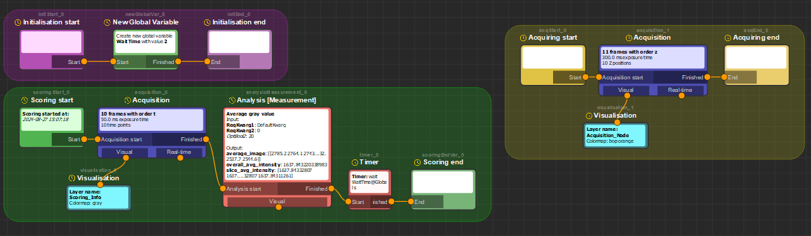

# Glados-pycromanager

Author: Koen J.A. Martens  
koenjamartens@gmail.com  
Created 2023-2024

<!-- TOC -->
- [General overview](#general-overview)
- [Installation instructions](#installation-instructions)
- [Running instructions](#running-instructions)
- [First use instructions](#first-use-instructions)
    - [Controls](#controls)
    - [Multi-D acquisition](#multi-d-acquisition)
- [Autonomous microscopy - Overview and Example 1: Simple autonomous microscopy](#autonomous-microscopy---overview-and-example-1-simple-autonomous-microscopy)
    - [Glados-pycromanager high level concept](#glados-pycromanager-high-level-concept)
    - [Glados-pycromanager recipes](#glados-pycromanager-recipes)
    - [Glados-pycromanager decision and scanning widgets](#glados-pycromanager-decision-and-scanning-widgets)
    - [Glados-pycromanager variables](#glados-pycromanager-variables)
    - [Testing and running Glados-pycromanager autonomous microscopy](#testing-and-running-glados-pycromanager-autonomous-microscopy)
- [Autonomous microscopy - Example 2: Advanced autonomous microscopy](#autonomous-microscopy---example-2-advanced-autonomous-microscopy)

<!-- /TOC -->

## General overview

Glados-pycromanager is an attempt to (1) create a usable, user-friendly user-interface for Pycromanager (i.e. python-Micromanager) with Napari, and (2) to create easy, user-friendly autonomous microscopy via Pycromanager.

## Installation instructions

Create a new conda environment, python version 3.10:

```batch
conda create -p C:\CondaEnvironments\GladosPycromanagerEnv python=3.10
```

Activate it:

```batch
conda activate C:\CondaEnvironments\GladosPycromanagerEnv
```

Install glados-pycromanager:

```batch
pip install "../glados_pycromanager-0.0.1-py3-none-any.whl"
```

Update micromanager to the latest nightly build:
https://micro-manager.org/Micro-Manager_Nightly_Builds

(Possibly) update pycro-manager to the latest pip version:

```batch
pip install --upgrade pycromanager
```

## Running instructions

First, run micromanager as normal, and ensure it is working as expected. Stop all live/acquisition, and follow one of these instructions:

There are a bunch of ways to run Glados-PycroManager. They are listed in order of user-friendliness:

##### Run glados-pycromanager directly from conda

Open the miniconda prompt, and run pycro-manager as follows:

```batch
conda activate C:\CondaEnvironments\GladosPycromanagerEnv
glados-pycromanager
```

This simply activates the correct environment and starts glados-pycromanager. You can create a .bat file as follows which will have a shortcut to do this: 

Please note that this assumes normal miniconda installation, otherwise you have to find your own miniconda installation path:

```batch
@echo off
call C:\ProgramData\miniconda3\Scripts\activate.bat C:\CondaEnvironments\GladosPycromanagerEnv
glados-pycromanager
```

##### Run napari from conda and open glados-pycromanager


Open the miniconda prompt, and run napari as follows:

```batch
conda activate C:\CondaEnvironments\GladosPycromanagerEnv
napari
```

An empty napari viewer will pop up. Within napari, use Plugins --> Glados (glados-pycromanager) to open the software suite.

##### Full debugging access via the python interface

Finally, you can fully clone glados-pycromanager from GitHub, and run 'GUI_napari.py' from the python enviroment, and it will open Napari with the glados-pycromanager plugin opened. This will allow you for full debugging accesss to the code, especially usefull when developing.

## First use instructions

After opening, an interface similar to this figure should pop up:

There are 4 main parts:

1. Contains the Glados-pycromanager interface, and can be switched between 'Controls' (i.e. controlling the microscope directly, live mode, configuration change, stage movement, etc), 'Multi-D acquisition' (i.e. perform multi-D acquisition similar as you would do in Micro-Manager), and 'Autonomous microscopy' (i.e. running smart/autonomous microscopy, more detail later)
2. With these tabs you can switch between Controls/Multi-D acquisition/Autonomous microscopy
3. Shows the layer information in Napari. Multiple layers can be open, and the visualisation options of the layer(s) can be changed here
4. Image viewer of napari.

### Controls

The controls tab contains most important and basic information for microscope control. From left to right, here is a quick description of what can be done from within napari:  

  - An **exposure time** can be set, and live/snap/album can be performed. Note that all of these create new layers. These images are not saved, but can be stored from within napari via File - Save Selected Layer(s).
  - The **shutter** controls the shutter similarly as in Micromanager
  - **ROI options** controls the ROI similarly as in Micromanager. Note that the 'Draw ROI' option requires a snapped/live image in the napari viewer, after which the user is asked to draw a rectangle. This rectangle will then be set as ROI.
  - There are four 'debug' buttons at the bottom of the General tab:
    - **Update all MM info**: Forces glados-pycromanager to update all values/variables from micromanager and displays them. Depending on your microscope setup, this can take a second or five (which is why it's not run constantly)
    - **Close all Layers**: Closes all napari layers.
    - **Force-reset**: If glados-pycromanager seems to be crashed, press this button. This tries to hard-quit all ongoing acquisitions etc, and often restores glados-pycromanager functionality.
    - **Adv. settings**: Opens a dialog window with some advanced settings. Currently, it contains info about connection to the Endesfelder lab slack (:D), and has some performance methods regarding visualisation.
  - In the **Configurations** area, all the configuration groups as set in Micromanager can be accessed/changed.
  - In the **Stages** area, all stages are displayed and can be moved. Layout is similar to the stage layout in micromanager, but generally, set the movement value by the fields next to the arrows, and press the arrows to move the stage this amount.

### Multi-D acquisition


The multi-D acquisition basically encompasses and expands on the regular micromanager Multi-D acquisition:

- In the **Options**, you can decide which options to use or not. Note that if Storage is not checked, the acquisition will only be saved temporarily and will be destroyed after.
- In **Order** you can decide the order of the multi-D acquisition. E.g. 'zt' means that it will go to Z-position 1, do all Time points, then moves to Z-position 2, do all Time points, etc etc.
- In **Exposure**, the exposure time in (milli-)seconds has to be set.
- In **Time**, a number of time points and time interval (i.e. minimum wait time between consequetive frames) has to be set. Please know that the time interval doesn't function together with the XY/Z/Channel orders, by pycromanager's design (https://github.com/micro-manager/pycro-manager/issues/733)
- In **XY**, you can set an XY gridding method. Similarly to Micromanager's stage position list, you can create a grid - additionally to micromanager, this grid can be oriented in different ways.
- In **Z**, a series of Z steps over a single stage can be set.
- In **Channel**, multiple channels can be run, each with different exposure times.

Pressing the 'Acquire' button will perform the acquisition and live-updates the results in the napari window.

## Autonomous microscopy - Overview and Example 1: Simple autonomous microscopy

Glados autonomous microscopy can best be explained via exemplary use cases. For these, ensure that MicroManager is running with the 'Demo' config.

This example covers the most basic use of autonomous glados-pycromanager. In glados-pycromanager, go to 'Autonomous Microscopy', press 'Load graph', and load the 'Showcase_Basic1.json' example. This should load a 'recipe' as follows:



We use this example recipe to explain the principles of Glados-pycromanager.

### Glados-pycromanager high level concept

The general idea of autonomous microscopy is to evaluate a field-of-view by a custom method ("Scoring", green), and only if this field-of-view is 'good enough', do a more detailed run ("Acquisition", yellow). An easy example would be a "Scoring" routine where it is detected that at least 20 cells are present and in focus, and only if this is the case, perform a "Acquisition" routine where a long-duration single-particle tracking experiment is performed.

### Glados-pycromanager recipes

- The user can create a 'recipe' (i.e. a graph) that defines the actions to be performed.
- This 'recipe' contains the following important sections:
  - 'Initialisation' (pink): this section is run once, and only once, at the start of a new autonomous microscopy run.
  - 'Scoring' (green): this section will be run for every field of view. This area will end with a 'Scoring End' node, after which a decision will be taken (simply put: deciding whether the FoV is good enough or not).
  - 'Acquisition' (yellow): this section will only be run for the fields of view that are deemed 'good enough' by the Scoring area.
- Each section consists of 'nodes' which contain instructions.
  - Nodes can be created by right-clicking on the graph-area and selecting the wanted node.
  - Nodes can be altered by double-clicking on the nodes and setting the proper settings. Which settings are available depends on the node.
  - Nodes should be connected (yellow lines) to each other by drawing connections from one 'plug' to a 'socket' (simply by click-drag the mouse). Connections can be broken by clicking on the connection (which is a bit finnicky and is on my list to fix :) )
- In our example, here is what each section is set up to do:
  - Initialisation (pink):
    - Initialisation start node: The initialisation area is started here.
    - New Global Variable node: A new global variable is created, which we call 'WaitTime', and we initialise this variable to be '2'. Variables can be accessed in all sections.
    - Initialisation end node: We let the graph know the Initialisation is completed.
  - Scoring (green):
    - Scoring start node: The scoring area is started here.
    - Acquisition node: A multi-D acquisition is run, in this case 10 consequetive frames are recorded with 50 ms frame time and 250 ms interval.
    - Visualisation node: A 'Visualisation' node is attached to the 'Visual' plug in the acquisition - this is optional, and provides visual feedbacvk on the acquisition, but if this is missing, the acquisition is similarly run, just not visualised.
    - Analysis [Measurement] node: After the acquisition is done, an 'analysis' is performed - in this case, the 'analysis' is simply taking the average gray value of the image stack recorded before. 
    - Timer Node: We then wait ('Timer') for a set time - in fact, we wait the time specified by 'WaitTime' initialised during the 'Initialisation' section (2 seconds).
    - Scoring end node: Finally, we let the graph know the scoring is completed
  - Acquisition (yellow):
    - Acquiring start node: The acquisition area is started here
    - Acquisition node: Similar to in scoring, we perform a multi-dimensional acquisition routine, this time taking 10 different Z positions
    - Visualisation node: Similar to scoring - we visualise the 10 different Z positions.
    - Acquiring end node: We let the graph know the scoring is completed.

### Glados-pycromanager decision and scanning widgets

In addition to this recipe, we need to more important definitions:

1. A 'Decision' needs to be defined - This is the criteria that should be fulfilled to judge a field-of-view to be 'good enough', and the full acquisition routine will be run. The decision can be set in the 'Decision widget', to the right of the graph area. Currently, the only working decision mode is 'Direct Decision', 'All VAR scoring conditions met'.  
In our example, we have the following decision (see below as well): we want the 'average intensity' determined via the Analysis [Measurement] node during the scoring to be at least 1000. As you see, a variable should be entered here. These variables can be accessed in the 'Variables' tab (explained below).  


2. 'Scanning' needs to be defined. This will be the list of fields-of-view that are assessed during the Scoring methodology. Currently, the only way to define this is by loading a .pos list (i.e. created via the 'Position list' in micromanager). Please, here, find the 'DemoCamPosList.pos' file attached to the Github folder (or create your own - the demo list contains 3 positions).  


### Glados-pycromanager variables

The variables widget contains all the variables. These are broadly separated in three categories: 

- *Global* variables, which have to be actively created/set/changed by the user, and are mostly usefull for e.g. counters, storage locations, etc.
- *Core* variables, which are specific to the exact microscope conditions at the time of assessment. E.g. this could be the current objective, current stage position, etc.
- *Node* variables, which are variables created/specified by some node. When hovering your mouse over these variables, the corresponding node in the graphing window will be highlighted. Very practically, these variables will be the outputs of e.g. the analysis methods. These are obviously dependant on exactly which nodes are ran.

The highlighted variable here is the 'overall average intensity' belonging to the 'analysisMeasurement_0' node, and the last known value is 1637. This is simply the output of the 'average gray value' node specified earlier.
This value is used for the decision widget, and to easily get this information in the other widget, if you press once on the variable, the exact variable nomenclature will be copied to the clipboard, and can be pasted in the decision area.  


**To figure out how to use variables in nodes, check the recipe `Showcase_Variables_1.json`**

### Testing and running Glados-pycromanager autonomous microscopy

If you are happy with your recipe and decision/scanning settings, you can test the autonomous microscopy run. It is recommended to test often during setting up new routines, especially if you're new to autonomous microscopy.
Generally, testing the 3 main parts of the autonomous microscopy run is recommended:

- Run 'Init only' (pink arrow) to run the pink initialisation section. Note that the intialisation nodes change from yellow 'waiting' status to green 'completed' status - this indicates that the nodes have run succesfully.
- Run 'Scoring only' (Green arrow) to run the green scoring section. No matter if the decision is passed or not, running 'Scoring only' will not go to the acquisition section. Similar to before, the node status will be changed to the green 'completed' status. Aditionally, a new layer will be created in napari with the name 'Scoring_Info' - this is defined in the 'Visualisation' node. Also note that the Timer node is waiting 2 seconds, as determined by the global WaitTime variable.
- Run 'Acquisition only' (Yellow arrow) to similarly run the yellow acquisition section. This will also generate a new layer (called 'Acquisition_Node').

If happy with everything, you can do the full run by clicking 'Start run', which will run the entire run (3 fields-of-view, as determined via the Scanning widget), and for each FoV perform the Scoring, assess the Decision (which will always pass if unchanged), and possibly run the Acquisition.  
Note that if you e.g. try to change the Decision widget such that the overall_avg_intensity@analysisMeasurement_0 is required to be at least 10000, the acquisition section will never run.

Additionally, you can load/store the graph (with attached decision/scanning widget) via the load/store graph buttons.

## Autonomous microscopy - Example 2: Advanced autonomous microscopy

A more advanced example of autonomous microscopy can be assessed by opening the 'Showcase_Advanced1.json' graph.

Here is a high-level overview of what is going on:  

In the initialisation phase, two variables are created: WaitTime and ScoringWillPass, both set to 1.


In the scoring phase, first a Slack Message is created (change Slack API settings in Controls - Advanced Settings), telling the user(s) how long the microscope willw ait. Then the microscope will actually wait this time. Then, an acquisition is performed and visualised, and a real-time analysis is performed. Real-time analysis is heavily work-in-progress, but this should show the current frame as a number on top of the frame - logically, real-time analysis can be used to change variables/settings/etc on the fly (e.g. increase UV laser power for PALM). After this acquisition, we perform an IF-statement based on the current value of WaitTime. If it's lower than 2, we increase the value by 1 (via 'Change Global Variable'). If it's not lower than 2, we will change the ScoringWillPass variable to 0. Logically, this entails that in this case, the ScoringWillPass will be 1 for the first scoring, but will change to 0 during the second scoring, preventing the acquisition after the first field-of-view.


Finally, in the acquisition section, in addition to the acquisition itself, some settings of the microscope are altered before/after acquisition: We set some configuration (in this case the 'Channel') to some value, and we change a stage position (the Z-position). Note that if you do not change this back, it will stay changed for the next scoring.

